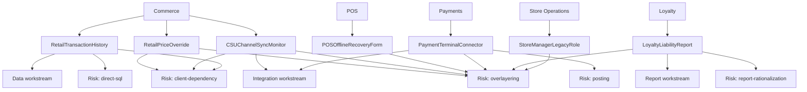

# AI Migration Dependency Graph

```mermaid
graph TD
  N_RetailPriceOverride["RetailPriceOverride"]
  N_module_Commerce["Commerce"] --> N_RetailPriceOverride
  N_RetailPriceOverride --> N_risk_client_dependency["Risk: client-dependency"]
  N_RetailPriceOverride --> N_risk_overlayering["Risk: overlayering"]
  N_CSUChannelSyncMonitor["CSUChannelSyncMonitor"]
  N_module_Commerce["Commerce"] --> N_CSUChannelSyncMonitor
  N_CSUChannelSyncMonitor --> N_risk_client_dependency["Risk: client-dependency"]
  N_CSUChannelSyncMonitor --> N_risk_overlayering["Risk: overlayering"]
  N_CSUChannelSyncMonitor --> N_gate_integration["Integration workstream"]
  N_POSOfflineRecoveryForm["POSOfflineRecoveryForm"]
  N_module_POS["POS"] --> N_POSOfflineRecoveryForm
  N_POSOfflineRecoveryForm --> N_risk_overlayering["Risk: overlayering"]
  N_PaymentTerminalConnector["PaymentTerminalConnector"]
  N_module_Payments["Payments"] --> N_PaymentTerminalConnector
  N_PaymentTerminalConnector --> N_risk_overlayering["Risk: overlayering"]
  N_PaymentTerminalConnector --> N_risk_posting["Risk: posting"]
  N_PaymentTerminalConnector --> N_gate_integration["Integration workstream"]
  N_LoyaltyLiabilityReport["LoyaltyLiabilityReport"]
  N_module_Loyalty["Loyalty"] --> N_LoyaltyLiabilityReport
  N_LoyaltyLiabilityReport --> N_risk_overlayering["Risk: overlayering"]
  N_LoyaltyLiabilityReport --> N_risk_report_rationalization["Risk: report-rationalization"]
  N_LoyaltyLiabilityReport --> N_gate_report["Report workstream"]
  N_RetailTransactionHistory["RetailTransactionHistory"]
  N_module_Commerce["Commerce"] --> N_RetailTransactionHistory
  N_RetailTransactionHistory --> N_risk_client_dependency["Risk: client-dependency"]
  N_RetailTransactionHistory --> N_risk_direct_sql["Risk: direct-sql"]
  N_RetailTransactionHistory --> N_gate_data["Data workstream"]
  N_StoreManagerLegacyRole["StoreManagerLegacyRole"]
  N_module_Store_Operations["Store Operations"] --> N_StoreManagerLegacyRole
  N_StoreManagerLegacyRole --> N_risk_overlayering["Risk: overlayering"]
```
