# CIO Architecture Pack

## Readiness Score

| Persona | Score | Interpretation |
| --- | --- | --- |
| CIO | 63/100 | Needs control |

## Next Actions

- Reduce high-risk scope before committing delivery baseline.

## Included Evidence

### persona-cio-architecture-view.md

# CIO Architecture View

| Item | Domain | Target pattern | Architecture risk | Effort |
| --- | --- | --- | --- | --- |
| CSUChannelSyncMonitor | integration | Middleware-backed D365FO integration pattern | client-dependency, overlayering | 11 |
| PaymentTerminalConnector | integration | Middleware-backed D365FO integration pattern | overlayering, posting | 11 |
| RetailTransactionHistory | data | Extension/service/data entity redesign | client-dependency, direct-sql | 10 |
| RetailPriceOverride | object | Extension/service/data entity redesign | client-dependency, overlayering | 9 |
| POSOfflineRecoveryForm | object | Form extension plus event handlers | overlayering | 9 |
| LoyaltyLiabilityReport | report | D365FO workspace, SSRS, Power BI, Financial Reporter, or archive | overlayering, report-rationalization | 7 |

## CIO Focus

- Remove unsupported legacy integration patterns.
- Reduce technical debt before cloud migration.
- Sequence high-risk rebuilds through architecture gates.

### ai-before-after-architecture.md

# AI Before / After Architecture

| Domain | Before AX | After D365FO |
| --- | --- | --- |
| Application | Dynamics AX legacy environment | Dynamics 365 Finance & Operations cloud environment |
| Integrations | CSUChannelSyncMonitor, PaymentTerminalConnector | OData, custom services, Business Events, middleware, managed files |
| Reporting | LoyaltyLiabilityReport | D365FO workspaces, SSRS, Power BI, Financial Reporter, archive |
| Data | RetailTransactionHistory | Data entities, recurring data jobs, archive/reporting store |
| Security | AX groups/roles | D365FO roles, duties, privileges, SoD controls |
| ALM | Layer/model deployment | Packages, build validation, release pipeline, environment governance |

### ai-upgrade-path-decision.md

# AI Upgrade Path Decision

| Factor | Assessment |
| --- | --- |
| Complexity rating | Medium |
| Rebuild / ISV review count | 4 |
| Scope reduction candidates | 0 |
| Recommended approach | Hybrid or reimplementation-led approach |
| Required validation | Confirm source AX version, Microsoft-supported tooling, data volume, and customization inventory. |

### ai-dependency-graph.md

# AI Migration Dependency Graph

```mermaid
graph TD
  N_RetailPriceOverride["RetailPriceOverride"]
  N_module_Commerce["Commerce"] --> N_RetailPriceOverride
  N_RetailPriceOverride --> N_risk_client_dependency["Risk: client-dependency"]
  N_RetailPriceOverride --> N_risk_overlayering["Risk: overlayering"]
  N_CSUChannelSyncMonitor["CSUChannelSyncMonitor"]
  N_module_Commerce["Commerce"] --> N_CSUChannelSyncMonitor
  N_CSUChannelSyncMonitor --> N_risk_client_dependency["Risk: client-dependency"]
  N_CSUChannelSyncMonitor --> N_risk_overlayering["Risk: overlayering"]
  N_CSUChannelSyncMonitor --> N_gate_integration["Integration workstream"]
  N_POSOfflineRecoveryForm["POSOfflineRecoveryForm"]
  N_module_POS["POS"] --> N_POSOfflineRecoveryForm
  N_POSOfflineRecoveryForm --> N_risk_overlayering["Risk: overlayering"]
  N_PaymentTerminalConnector["PaymentTerminalConnector"]
  N_module_Payments["Payments"] --> N_PaymentTerminalConnector
  N_PaymentTerminalConnector --> N_risk_overlayering["Risk: overlayering"]
  N_PaymentTerminalConnector --> N_risk_posting["Risk: posting"]
  N_PaymentTerminalConnector --> N_gate_integration["Integration workstream"]
  N_LoyaltyLiabilityReport["LoyaltyLiabilityReport"]
  N_module_Loyalty["Loyalty"] --> N_LoyaltyLiabilityReport
  N_LoyaltyLiabilityReport --> N_risk_overlayering["Risk: overlayering"]
  N_LoyaltyLiabilityReport --> N_risk_report_rationalization["Risk: report-rationalization"]
  N_LoyaltyLiabilityReport --> N_gate_report["Report workstream"]
  N_RetailTransactionHistory["RetailTransactionHistory"]
  N_module_Commerce["Commerce"] --> N_RetailTransactionHistory
  N_RetailTransactionHistory --> N_risk_client_dependency["Risk: client-dependency"]
  N_RetailTransactionHistory --> N_risk_direct_sql["Risk: direct-sql"]
  N_RetailTransactionHistory --> N_gate_data["Data workstream"]
  N_StoreManagerLegacyRole["StoreManagerLegacyRole"]
  N_module_Store_Operations["Store Operations"] --> N_StoreManagerLegacyRole
  N_StoreManagerLegacyRole --> N_risk_overlayering["Risk: overlayering"]
```

### ai-adrs.md

# Architecture Decision Records

| ID | Decision | Context | Decision | Status |
| --- | --- | --- | --- | --- |
| ADR-001 | Disposition for RetailPriceOverride | Unsupported legacy dependency detected. | Rebuild | Proposed |
| ADR-002 | Disposition for CSUChannelSyncMonitor | Legacy integrations usually need redesign for D365FO operations and monitoring. | Rebuild | Proposed |
| ADR-003 | Disposition for POSOfflineRecoveryForm | Customization likely needs extension-based migration. | Extend | Proposed |
| ADR-004 | Disposition for PaymentTerminalConnector | Legacy integrations usually need redesign for D365FO operations and monitoring. | Rebuild | Proposed |
| ADR-005 | Disposition for RetailTransactionHistory | Unsupported legacy dependency detected. | Rebuild | Proposed |
