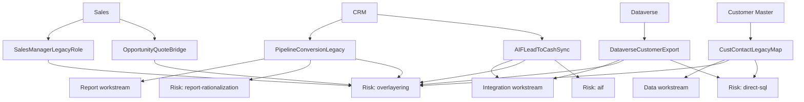

# AI Migration Dependency Graph

```mermaid
graph TD
  N_AIFLeadToCashSync["AIFLeadToCashSync"]
  N_module_CRM["CRM"] --> N_AIFLeadToCashSync
  N_AIFLeadToCashSync --> N_risk_aif["Risk: aif"]
  N_AIFLeadToCashSync --> N_risk_overlayering["Risk: overlayering"]
  N_AIFLeadToCashSync --> N_gate_integration["Integration workstream"]
  N_CustContactLegacyMap["CustContactLegacyMap"]
  N_module_Customer_Master["Customer Master"] --> N_CustContactLegacyMap
  N_CustContactLegacyMap --> N_risk_direct_sql["Risk: direct-sql"]
  N_CustContactLegacyMap --> N_risk_overlayering["Risk: overlayering"]
  N_CustContactLegacyMap --> N_gate_data["Data workstream"]
  N_OpportunityQuoteBridge["OpportunityQuoteBridge"]
  N_module_Sales["Sales"] --> N_OpportunityQuoteBridge
  N_OpportunityQuoteBridge --> N_risk_overlayering["Risk: overlayering"]
  N_DataverseCustomerExport["DataverseCustomerExport"]
  N_module_Dataverse["Dataverse"] --> N_DataverseCustomerExport
  N_DataverseCustomerExport --> N_risk_direct_sql["Risk: direct-sql"]
  N_DataverseCustomerExport --> N_risk_overlayering["Risk: overlayering"]
  N_DataverseCustomerExport --> N_gate_integration["Integration workstream"]
  N_PipelineConversionLegacy["PipelineConversionLegacy"]
  N_module_CRM["CRM"] --> N_PipelineConversionLegacy
  N_PipelineConversionLegacy --> N_risk_overlayering["Risk: overlayering"]
  N_PipelineConversionLegacy --> N_risk_report_rationalization["Risk: report-rationalization"]
  N_PipelineConversionLegacy --> N_gate_report["Report workstream"]
  N_SalesManagerLegacyRole["SalesManagerLegacyRole"]
  N_module_Sales["Sales"] --> N_SalesManagerLegacyRole
  N_SalesManagerLegacyRole --> N_risk_overlayering["Risk: overlayering"]
```
