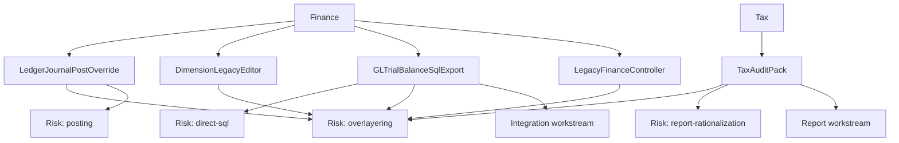

# AI Migration Dependency Graph

```mermaid
graph TD
  N_LedgerJournalPostOverride["LedgerJournalPostOverride"]
  N_module_Finance["Finance"] --> N_LedgerJournalPostOverride
  N_LedgerJournalPostOverride --> N_risk_overlayering["Risk: overlayering"]
  N_LedgerJournalPostOverride --> N_risk_posting["Risk: posting"]
  N_DimensionLegacyEditor["DimensionLegacyEditor"]
  N_module_Finance["Finance"] --> N_DimensionLegacyEditor
  N_DimensionLegacyEditor --> N_risk_overlayering["Risk: overlayering"]
  N_GLTrialBalanceSqlExport["GLTrialBalanceSqlExport"]
  N_module_Finance["Finance"] --> N_GLTrialBalanceSqlExport
  N_GLTrialBalanceSqlExport --> N_risk_direct_sql["Risk: direct-sql"]
  N_GLTrialBalanceSqlExport --> N_risk_overlayering["Risk: overlayering"]
  N_GLTrialBalanceSqlExport --> N_gate_integration["Integration workstream"]
  N_TaxAuditPack["TaxAuditPack"]
  N_module_Tax["Tax"] --> N_TaxAuditPack
  N_TaxAuditPack --> N_risk_overlayering["Risk: overlayering"]
  N_TaxAuditPack --> N_risk_report_rationalization["Risk: report-rationalization"]
  N_TaxAuditPack --> N_gate_report["Report workstream"]
  N_LegacyFinanceController["LegacyFinanceController"]
  N_module_Finance["Finance"] --> N_LegacyFinanceController
  N_LegacyFinanceController --> N_risk_overlayering["Risk: overlayering"]
```
