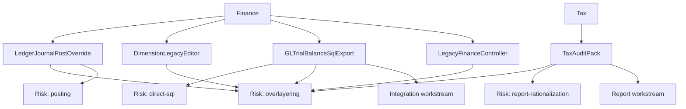

# CIO Architecture Pack

## Readiness Score

| Persona | Score | Interpretation |
| --- | --- | --- |
| CIO | 65/100 | Needs control |

## Next Actions

- Reduce high-risk scope before committing delivery baseline.

## Included Evidence

### persona-cio-architecture-view.md

# CIO Architecture View

| Item | Domain | Target pattern | Architecture risk | Effort |
| --- | --- | --- | --- | --- |
| GLTrialBalanceSqlExport | integration | Data entity, export, reporting replica, or data lake pattern | direct-sql, overlayering | 11 |
| LedgerJournalPostOverride | object | Chain of Command or event handler | overlayering, posting | 9 |
| TaxAuditPack | report | D365FO workspace, SSRS, Power BI, Financial Reporter, or archive | overlayering, report-rationalization | 9 |
| DimensionLegacyEditor | object | Business validation before migration | overlayering | 7 |

## CIO Focus

- Remove unsupported legacy integration patterns.
- Reduce technical debt before cloud migration.
- Sequence high-risk rebuilds through architecture gates.

### ai-before-after-architecture.md

# AI Before / After Architecture

| Domain | Before AX | After D365FO |
| --- | --- | --- |
| Application | Dynamics AX legacy environment | Dynamics 365 Finance & Operations cloud environment |
| Integrations | GLTrialBalanceSqlExport | OData, custom services, Business Events, middleware, managed files |
| Reporting | TaxAuditPack | D365FO workspaces, SSRS, Power BI, Financial Reporter, archive |
| Data | Legacy data domains not inventoried | Data entities, recurring data jobs, archive/reporting store |
| Security | AX groups/roles | D365FO roles, duties, privileges, SoD controls |
| ALM | Layer/model deployment | Packages, build validation, release pipeline, environment governance |

### ai-upgrade-path-decision.md

# AI Upgrade Path Decision

| Factor | Assessment |
| --- | --- |
| Complexity rating | Medium |
| Rebuild / ISV review count | 1 |
| Scope reduction candidates | 1 |
| Recommended approach | Evaluate upgrade-led or hybrid approach |
| Required validation | Confirm source AX version, Microsoft-supported tooling, data volume, and customization inventory. |

### ai-dependency-graph.md

# AI Migration Dependency Graph

### ai-adrs.md

# Architecture Decision Records

| ID | Decision | Context | Decision | Status |
| --- | --- | --- | --- | --- |
| ADR-001 | Disposition for LedgerJournalPostOverride | Customization likely needs extension-based migration. | Extend | Proposed |
| ADR-002 | Disposition for DimensionLegacyEditor | Low usage suggests scope reduction opportunity. | Retire Candidate | Proposed |
| ADR-003 | Disposition for GLTrialBalanceSqlExport | Legacy integrations usually need redesign for D365FO operations and monitoring. | Rebuild | Proposed |
| ADR-004 | Disposition for TaxAuditPack | Reports should be rationalized before rebuild. | Standard / Power BI Review | Proposed |
