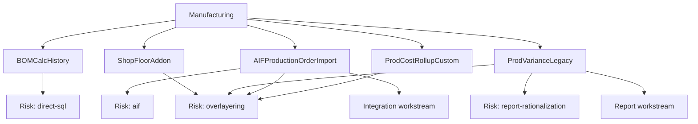

# AI Migration Dependency Graph

```mermaid
graph TD
  N_ProdCostRollupCustom["ProdCostRollupCustom"]
  N_module_Manufacturing["Manufacturing"] --> N_ProdCostRollupCustom
  N_ProdCostRollupCustom --> N_risk_overlayering["Risk: overlayering"]
  N_BOMCalcHistory["BOMCalcHistory"]
  N_module_Manufacturing["Manufacturing"] --> N_BOMCalcHistory
  N_BOMCalcHistory --> N_risk_direct_sql["Risk: direct-sql"]
  N_AIFProductionOrderImport["AIFProductionOrderImport"]
  N_module_Manufacturing["Manufacturing"] --> N_AIFProductionOrderImport
  N_AIFProductionOrderImport --> N_risk_aif["Risk: aif"]
  N_AIFProductionOrderImport --> N_risk_overlayering["Risk: overlayering"]
  N_AIFProductionOrderImport --> N_gate_integration["Integration workstream"]
  N_ProdVarianceLegacy["ProdVarianceLegacy"]
  N_module_Manufacturing["Manufacturing"] --> N_ProdVarianceLegacy
  N_ProdVarianceLegacy --> N_risk_overlayering["Risk: overlayering"]
  N_ProdVarianceLegacy --> N_risk_report_rationalization["Risk: report-rationalization"]
  N_ProdVarianceLegacy --> N_gate_report["Report workstream"]
  N_ShopFloorAddon["ShopFloorAddon"]
  N_module_Manufacturing["Manufacturing"] --> N_ShopFloorAddon
  N_ShopFloorAddon --> N_risk_overlayering["Risk: overlayering"]
```
