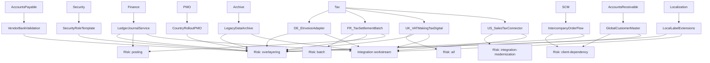

# AI Migration Dependency Graph

```mermaid
graph TD
  N_LedgerJournalService["LedgerJournalService"]
  N_module_Finance["Finance"] --> N_LedgerJournalService
  N_LedgerJournalService --> N_risk_overlayering["Risk: overlayering"]
  N_LedgerJournalService --> N_risk_posting["Risk: posting"]
  N_LedgerJournalService --> N_gate_integration["Integration workstream"]
  N_DE_EInvoiceAdapter["DE_EInvoiceAdapter"]
  N_module_Tax["Tax"] --> N_DE_EInvoiceAdapter
  N_DE_EInvoiceAdapter --> N_risk_overlayering["Risk: overlayering"]
  N_DE_EInvoiceAdapter --> N_gate_integration["Integration workstream"]
  N_FR_TaxSettlementBatch["FR_TaxSettlementBatch"]
  N_module_Tax["Tax"] --> N_FR_TaxSettlementBatch
  N_FR_TaxSettlementBatch --> N_risk_batch["Risk: batch"]
  N_FR_TaxSettlementBatch --> N_risk_overlayering["Risk: overlayering"]
  N_FR_TaxSettlementBatch --> N_risk_posting["Risk: posting"]
  N_UK_VATMakingTaxDigital["UK_VATMakingTaxDigital"]
  N_module_Tax["Tax"] --> N_UK_VATMakingTaxDigital
  N_UK_VATMakingTaxDigital --> N_risk_aif["Risk: aif"]
  N_UK_VATMakingTaxDigital --> N_risk_overlayering["Risk: overlayering"]
  N_UK_VATMakingTaxDigital --> N_gate_integration["Integration workstream"]
  N_US_SalesTaxConnector["US_SalesTaxConnector"]
  N_module_Tax["Tax"] --> N_US_SalesTaxConnector
  N_US_SalesTaxConnector --> N_risk_integration_modernization["Risk: integration-modernization"]
  N_US_SalesTaxConnector --> N_gate_integration["Integration workstream"]
  N_IntercompanyOrderFlow["IntercompanyOrderFlow"]
  N_module_SCM["SCM"] --> N_IntercompanyOrderFlow
  N_IntercompanyOrderFlow --> N_risk_client_dependency["Risk: client-dependency"]
  N_IntercompanyOrderFlow --> N_risk_overlayering["Risk: overlayering"]
  N_GlobalCustomerMaster["GlobalCustomerMaster"]
  N_module_AccountsReceivable["AccountsReceivable"] --> N_GlobalCustomerMaster
  N_GlobalCustomerMaster --> N_risk_client_dependency["Risk: client-dependency"]
  N_GlobalCustomerMaster --> N_risk_overlayering["Risk: overlayering"]
  N_VendorBankValidation["VendorBankValidation"]
  N_module_AccountsPayable["AccountsPayable"] --> N_VendorBankValidation
  N_VendorBankValidation --> N_risk_overlayering["Risk: overlayering"]
  N_SecurityRoleTemplate["SecurityRoleTemplate"]
  N_module_Security["Security"] --> N_SecurityRoleTemplate
  N_SecurityRoleTemplate --> N_risk_overlayering["Risk: overlayering"]
  N_LegacyDataArchive["LegacyDataArchive"]
  N_module_Archive["Archive"] --> N_LegacyDataArchive
  N_LegacyDataArchive --> N_risk_overlayering["Risk: overlayering"]
  N_LegacyDataArchive --> N_gate_integration["Integration workstream"]
  N_CountryRolloutPMO["CountryRolloutPMO"]
  N_module_PMO["PMO"] --> N_CountryRolloutPMO
  N_CountryRolloutPMO --> N_risk_overlayering["Risk: overlayering"]
  N_LocalLabelExtensions["LocalLabelExtensions"]
  N_module_Localization["Localization"] --> N_LocalLabelExtensions
  N_LocalLabelExtensions --> N_risk_overlayering["Risk: overlayering"]
  N_LocalLabelExtensions --> N_gate_integration["Integration workstream"]
```
