# CIO Architecture Pack

## Readiness Score

| Persona | Score | Interpretation |
| --- | --- | --- |
| CIO | 54/100 | Needs control |

## Next Actions

- Reduce high-risk scope before committing delivery baseline.

## Included Evidence

### persona-cio-architecture-view.md

# CIO Architecture View

| Item | Domain | Target pattern | Architecture risk | Effort |
| --- | --- | --- | --- | --- |
| LedgerJournalService | integration | Middleware-backed D365FO integration pattern | overlayering, posting | 7 |
| FR_TaxSettlementBatch | object | SysOperation/batch framework alignment | batch, overlayering, posting | 7 |
| UK_VATMakingTaxDigital | integration | OData, custom service, Business Events, or middleware | aif, overlayering | 7 |
| DE_EInvoiceAdapter | integration | Middleware-backed D365FO integration pattern | overlayering | 6 |
| US_SalesTaxConnector | integration | Middleware-backed D365FO integration pattern | integration-modernization | 6 |
| LegacyDataArchive | integration | Middleware-backed D365FO integration pattern | overlayering | 6 |
| LocalLabelExtensions | integration | Middleware-backed D365FO integration pattern | overlayering | 6 |
| IntercompanyOrderFlow | object | Extension/service/data entity redesign | client-dependency, overlayering | 5 |
| GlobalCustomerMaster | object | Extension/service/data entity redesign | client-dependency, overlayering | 5 |
| VendorBankValidation | object | Chain of Command or event handler | overlayering | 4 |
| CountryRolloutPMO | object | Fit-gap validation required | overlayering | 3 |

## CIO Focus

- Remove unsupported legacy integration patterns.
- Reduce technical debt before cloud migration.
- Sequence high-risk rebuilds through architecture gates.

### ai-before-after-architecture.md

# AI Before / After Architecture

| Domain | Before AX | After D365FO |
| --- | --- | --- |
| Application | Dynamics AX legacy environment | Dynamics 365 Finance & Operations cloud environment |
| Integrations | LedgerJournalService, DE_EInvoiceAdapter, UK_VATMakingTaxDigital, US_SalesTaxConnector, LegacyDataArchive, LocalLabelExtensions | OData, custom services, Business Events, middleware, managed files |
| Reporting | Legacy reports not inventoried | D365FO workspaces, SSRS, Power BI, Financial Reporter, archive |
| Data | Legacy data domains not inventoried | Data entities, recurring data jobs, archive/reporting store |
| Security | AX groups/roles | D365FO roles, duties, privileges, SoD controls |
| ALM | Layer/model deployment | Packages, build validation, release pipeline, environment governance |

### ai-upgrade-path-decision.md

# AI Upgrade Path Decision

| Factor | Assessment |
| --- | --- |
| Complexity rating | Medium |
| Rebuild / ISV review count | 8 |
| Scope reduction candidates | 0 |
| Recommended approach | Reimplementation-led approach with aggressive scope reduction |
| Required validation | Confirm source AX version, Microsoft-supported tooling, data volume, and customization inventory. |

### ai-dependency-graph.md

# AI Migration Dependency Graph

```mermaid
graph TD
  N_LedgerJournalService["LedgerJournalService"]
  N_module_Finance["Finance"] --> N_LedgerJournalService
  N_LedgerJournalService --> N_risk_overlayering["Risk: overlayering"]
  N_LedgerJournalService --> N_risk_posting["Risk: posting"]
  N_LedgerJournalService --> N_gate_integration["Integration workstream"]
  N_DE_EInvoiceAdapter["DE_EInvoiceAdapter"]
  N_module_Tax["Tax"] --> N_DE_EInvoiceAdapter
  N_DE_EInvoiceAdapter --> N_risk_overlayering["Risk: overlayering"]
  N_DE_EInvoiceAdapter --> N_gate_integration["Integration workstream"]
  N_FR_TaxSettlementBatch["FR_TaxSettlementBatch"]
  N_module_Tax["Tax"] --> N_FR_TaxSettlementBatch
  N_FR_TaxSettlementBatch --> N_risk_batch["Risk: batch"]
  N_FR_TaxSettlementBatch --> N_risk_overlayering["Risk: overlayering"]
  N_FR_TaxSettlementBatch --> N_risk_posting["Risk: posting"]
  N_UK_VATMakingTaxDigital["UK_VATMakingTaxDigital"]
  N_module_Tax["Tax"] --> N_UK_VATMakingTaxDigital
  N_UK_VATMakingTaxDigital --> N_risk_aif["Risk: aif"]
  N_UK_VATMakingTaxDigital --> N_risk_overlayering["Risk: overlayering"]
  N_UK_VATMakingTaxDigital --> N_gate_integration["Integration workstream"]
  N_US_SalesTaxConnector["US_SalesTaxConnector"]
  N_module_Tax["Tax"] --> N_US_SalesTaxConnector
  N_US_SalesTaxConnector --> N_risk_integration_modernization["Risk: integration-modernization"]
  N_US_SalesTaxConnector --> N_gate_integration["Integration workstream"]
  N_IntercompanyOrderFlow["IntercompanyOrderFlow"]
  N_module_SCM["SCM"] --> N_IntercompanyOrderFlow
  N_IntercompanyOrderFlow --> N_risk_client_dependency["Risk: client-dependency"]
  N_IntercompanyOrderFlow --> N_risk_overlayering["Risk: overlayering"]
  N_GlobalCustomerMaster["GlobalCustomerMaster"]
  N_module_AccountsReceivable["AccountsReceivable"] --> N_GlobalCustomerMaster
  N_GlobalCustomerMaster --> N_risk_client_dependency["Risk: client-dependency"]
  N_GlobalCustomerMaster --> N_risk_overlayering["Risk: overlayering"]
  N_VendorBankValidation["VendorBankValidation"]
  N_module_AccountsPayable["AccountsPayable"] --> N_VendorBankValidation
  N_VendorBankValidation --> N_risk_overlayering["Risk: overlayering"]
  N_SecurityRoleTemplate["SecurityRoleTemplate"]
  N_module_Security["Security"] --> N_SecurityRoleTemplate
  N_SecurityRoleTemplate --> N_risk_overlayering["Risk: overlayering"]
  N_LegacyDataArchive["LegacyDataArchive"]
  N_module_Archive["Archive"] --> N_LegacyDataArchive
  N_LegacyDataArchive --> N_risk_overlayering["Risk: overlayering"]
  N_LegacyDataArchive --> N_gate_integration["Integration workstream"]
  N_CountryRolloutPMO["CountryRolloutPMO"]
  N_module_PMO["PMO"] --> N_CountryRolloutPMO
  N_CountryRolloutPMO --> N_risk_overlayering["Risk: overlayering"]
  N_LocalLabelExtensions["LocalLabelExtensions"]
  N_module_Localization["Localization"] --> N_LocalLabelExtensions
  N_LocalLabelExtensions --> N_risk_overlayering["Risk: overlayering"]
  N_LocalLabelExtensions --> N_gate_integration["Integration workstream"]
```

### ai-adrs.md

# Architecture Decision Records

| ID | Decision | Context | Decision | Status |
| --- | --- | --- | --- | --- |
