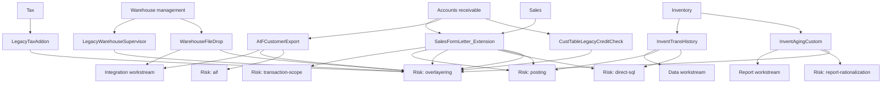

# AI Migration Dependency Graph

```mermaid
graph TD
  N_SalesFormLetter_Extension["SalesFormLetter_Extension"]
  N_module_Sales["Sales"] --> N_SalesFormLetter_Extension
  N_SalesFormLetter_Extension --> N_risk_overlayering["Risk: overlayering"]
  N_SalesFormLetter_Extension --> N_risk_posting["Risk: posting"]
  N_CustTableLegacyCreditCheck["CustTableLegacyCreditCheck"]
  N_module_Accounts_receivable["Accounts receivable"] --> N_CustTableLegacyCreditCheck
  N_CustTableLegacyCreditCheck --> N_risk_overlayering["Risk: overlayering"]
  N_AIFCustomerExport["AIFCustomerExport"]
  N_module_Accounts_receivable["Accounts receivable"] --> N_AIFCustomerExport
  N_AIFCustomerExport --> N_risk_aif["Risk: aif"]
  N_AIFCustomerExport --> N_risk_overlayering["Risk: overlayering"]
  N_AIFCustomerExport --> N_gate_integration["Integration workstream"]
  N_WarehouseFileDrop["WarehouseFileDrop"]
  N_module_Warehouse_management["Warehouse management"] --> N_WarehouseFileDrop
  N_WarehouseFileDrop --> N_risk_overlayering["Risk: overlayering"]
  N_WarehouseFileDrop --> N_gate_integration["Integration workstream"]
  N_InventAgingCustom["InventAgingCustom"]
  N_module_Inventory["Inventory"] --> N_InventAgingCustom
  N_InventAgingCustom --> N_risk_overlayering["Risk: overlayering"]
  N_InventAgingCustom --> N_risk_report_rationalization["Risk: report-rationalization"]
  N_InventAgingCustom --> N_gate_report["Report workstream"]
  N_LegacyTaxAddon["LegacyTaxAddon"]
  N_module_Tax["Tax"] --> N_LegacyTaxAddon
  N_LegacyTaxAddon --> N_risk_overlayering["Risk: overlayering"]
  N_LegacyWarehouseSupervisor["LegacyWarehouseSupervisor"]
  N_module_Warehouse_management["Warehouse management"] --> N_LegacyWarehouseSupervisor
  N_LegacyWarehouseSupervisor --> N_risk_overlayering["Risk: overlayering"]
  N_InventTransHistory["InventTransHistory"]
  N_module_Inventory["Inventory"] --> N_InventTransHistory
  N_InventTransHistory --> N_risk_direct_sql["Risk: direct-sql"]
  N_InventTransHistory --> N_risk_posting["Risk: posting"]
  N_InventTransHistory --> N_gate_data["Data workstream"]
  N_SalesFormLetter_Extension["SalesFormLetter_Extension"]
  N_module_Accounts_receivable["Accounts receivable"] --> N_SalesFormLetter_Extension
  N_SalesFormLetter_Extension --> N_risk_direct_sql["Risk: direct-sql"]
  N_SalesFormLetter_Extension --> N_risk_overlayering["Risk: overlayering"]
  N_SalesFormLetter_Extension --> N_risk_posting["Risk: posting"]
  N_SalesFormLetter_Extension --> N_risk_transaction_scope["Risk: transaction-scope"]
```
