# CIO Architecture Pack

## Readiness Score

| Persona | Score | Interpretation |
| --- | --- | --- |
| CIO | 56/100 | Needs control |

## Next Actions

- Reduce high-risk scope before committing delivery baseline.

## Included Evidence

### persona-cio-architecture-view.md

# CIO Architecture View

| Item | Domain | Target pattern | Architecture risk | Effort |
| --- | --- | --- | --- | --- |
| AIFCustomerExport | integration | OData, custom service, Business Events, or middleware | aif, overlayering | 11 |
| LegacyTaxAddon | isv | D365FO ISV successor, standard replacement, custom extension, or retire | overlayering | 11 |
| SalesFormLetter_Extension | object | Extension/service/data entity redesign | direct-sql, overlayering, posting, transaction-scope | 11 |
| InventTransHistory | data | Extension/service/data entity redesign | direct-sql, posting | 10 |
| SalesFormLetter_Extension | object | Chain of Command or event handler | overlayering, posting | 9 |
| WarehouseFileDrop | integration | Managed file integration through middleware or recurring data jobs | overlayering | 8 |
| CustTableLegacyCreditCheck | object | Business validation before migration | overlayering | 7 |
| InventAgingCustom | report | D365FO workspace, SSRS, Power BI, Financial Reporter, or archive | overlayering, report-rationalization | 7 |

## CIO Focus

- Remove unsupported legacy integration patterns.
- Reduce technical debt before cloud migration.
- Sequence high-risk rebuilds through architecture gates.

### ai-before-after-architecture.md

# AI Before / After Architecture

| Domain | Before AX | After D365FO |
| --- | --- | --- |
| Application | Dynamics AX legacy environment | Dynamics 365 Finance & Operations cloud environment |
| Integrations | AIFCustomerExport, WarehouseFileDrop | OData, custom services, Business Events, middleware, managed files |
| Reporting | InventAgingCustom | D365FO workspaces, SSRS, Power BI, Financial Reporter, archive |
| Data | InventTransHistory | Data entities, recurring data jobs, archive/reporting store |
| Security | AX groups/roles | D365FO roles, duties, privileges, SoD controls |
| ALM | Layer/model deployment | Packages, build validation, release pipeline, environment governance |

### ai-upgrade-path-decision.md

# AI Upgrade Path Decision

| Factor | Assessment |
| --- | --- |
| Complexity rating | High |
| Rebuild / ISV review count | 5 |
| Scope reduction candidates | 1 |
| Recommended approach | Reimplementation-led approach with aggressive scope reduction |
| Required validation | Confirm source AX version, Microsoft-supported tooling, data volume, and customization inventory. |

### ai-dependency-graph.md

# AI Migration Dependency Graph

```mermaid
graph TD
  N_SalesFormLetter_Extension["SalesFormLetter_Extension"]
  N_module_Sales["Sales"] --> N_SalesFormLetter_Extension
  N_SalesFormLetter_Extension --> N_risk_overlayering["Risk: overlayering"]
  N_SalesFormLetter_Extension --> N_risk_posting["Risk: posting"]
  N_CustTableLegacyCreditCheck["CustTableLegacyCreditCheck"]
  N_module_Accounts_receivable["Accounts receivable"] --> N_CustTableLegacyCreditCheck
  N_CustTableLegacyCreditCheck --> N_risk_overlayering["Risk: overlayering"]
  N_AIFCustomerExport["AIFCustomerExport"]
  N_module_Accounts_receivable["Accounts receivable"] --> N_AIFCustomerExport
  N_AIFCustomerExport --> N_risk_aif["Risk: aif"]
  N_AIFCustomerExport --> N_risk_overlayering["Risk: overlayering"]
  N_AIFCustomerExport --> N_gate_integration["Integration workstream"]
  N_WarehouseFileDrop["WarehouseFileDrop"]
  N_module_Warehouse_management["Warehouse management"] --> N_WarehouseFileDrop
  N_WarehouseFileDrop --> N_risk_overlayering["Risk: overlayering"]
  N_WarehouseFileDrop --> N_gate_integration["Integration workstream"]
  N_InventAgingCustom["InventAgingCustom"]
  N_module_Inventory["Inventory"] --> N_InventAgingCustom
  N_InventAgingCustom --> N_risk_overlayering["Risk: overlayering"]
  N_InventAgingCustom --> N_risk_report_rationalization["Risk: report-rationalization"]
  N_InventAgingCustom --> N_gate_report["Report workstream"]
  N_LegacyTaxAddon["LegacyTaxAddon"]
  N_module_Tax["Tax"] --> N_LegacyTaxAddon
  N_LegacyTaxAddon --> N_risk_overlayering["Risk: overlayering"]
  N_LegacyWarehouseSupervisor["LegacyWarehouseSupervisor"]
  N_module_Warehouse_management["Warehouse management"] --> N_LegacyWarehouseSupervisor
  N_LegacyWarehouseSupervisor --> N_risk_overlayering["Risk: overlayering"]
  N_InventTransHistory["InventTransHistory"]
  N_module_Inventory["Inventory"] --> N_InventTransHistory
  N_InventTransHistory --> N_risk_direct_sql["Risk: direct-sql"]
  N_InventTransHistory --> N_risk_posting["Risk: posting"]
  N_InventTransHistory --> N_gate_data["Data workstream"]
  N_SalesFormLetter_Extension["SalesFormLetter_Extension"]
  N_module_Accounts_receivable["Accounts receivable"] --> N_SalesFormLetter_Extension
  N_SalesFormLetter_Extension --> N_risk_direct_sql["Risk: direct-sql"]
  N_SalesFormLetter_Extension --> N_risk_overlayering["Risk: overlayering"]
  N_SalesFormLetter_Extension --> N_risk_posting["Risk: posting"]
  N_SalesFormLetter_Extension --> N_risk_transaction_scope["Risk: transaction-scope"]
```

### ai-adrs.md

# Architecture Decision Records

| ID | Decision | Context | Decision | Status |
| --- | --- | --- | --- | --- |
| ADR-001 | Disposition for SalesFormLetter_Extension | Customization likely needs extension-based migration. | Extend | Proposed |
| ADR-002 | Disposition for CustTableLegacyCreditCheck | Low usage suggests scope reduction opportunity. | Retire Candidate | Proposed |
| ADR-003 | Disposition for AIFCustomerExport | Legacy integrations usually need redesign for D365FO operations and monitoring. | Rebuild | Proposed |
| ADR-004 | Disposition for WarehouseFileDrop | Legacy integrations usually need redesign for D365FO operations and monitoring. | Rebuild | Proposed |
| ADR-005 | Disposition for LegacyTaxAddon | ISV capability needs product roadmap and licensing validation. | ISV Review | Proposed |
| ADR-006 | Disposition for InventTransHistory | Unsupported legacy dependency detected. | Rebuild | Proposed |
| ADR-007 | Disposition for SalesFormLetter_Extension | Unsupported legacy dependency detected. | Rebuild | Proposed |
